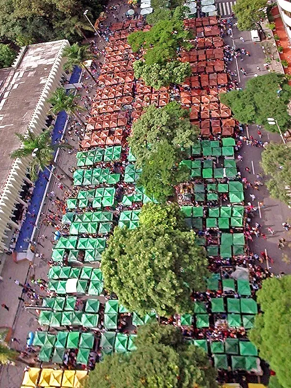

# Tópico 3 – BabyPandas, DataFrames e Séries [](https://colab.research.google.com/github/urielmoreirasilva/urielmoreirasilva.github.io/blob/main/aulas/T%C3%B3pico%2003/03%20%E2%80%93%20BabyPandas.ipynb) [](https://github.com/urielmoreirasilva/urielmoreirasilva.github.io/blob/main/aulas/T%C3%B3pico%2003/03%20%E2%80%93%20BabyPandas.ipynb)

`DataFrames` são objetos utilizados para representar tabelas. Vamos finalmente explorar alguns dados!
    
### Resultados Esperados
1. Entender o que são os `DataFrame`s de `pandas`.
1. Aprender a acessar linhas e colunas de um DataFrame.
1. Aprender a realizar consultas básicas em um DataFrame.

### Referências
- [BPD, Capítulo 9](https://notes.dsc10.com/)
- [CIT, Capítulo 6](https://inferentialthinking.com/)

Material adaptado do [DSC10 (UCSD)](https://dsc10.com/) por [Flavio Figueiredo (DCC-UFMG)](https://flaviovdf.io/fcd/) e [Uriel Silva (DEST-UFMG)](https://urielmoreirasilva.github.io)

## Data Frames

### `pandas`

- Os `DataFrames` (objetos que podem ser utilizados para representarem "tabelas") são usualmente fornecidos de um pacote chamado `pandas`.
- `pandas` é **a** ferramenta para fazer ciência de dados em Python.

<center>
    
</center>

### Mas a biblioteca `pandas` padrão não é tão fofa...

<center>
    
</center>

### Começaremos então pelo `babypandas`!

- Criada pela Universidade da Califórnia em San Diego (UCSD), o `babypandas` é uma versão menor e mais agradável do `pandas`.
- Em essência, o `babypandas` mantém os elementos mais importantes e a estrutura principal do `pandas`, mas com defaults mais genéricos e uma sintaxe mais simples.
- O `babypandas` é mais fácil de aprender, de debugar, e o melhor: todo código escrito em `babypandas` é válido no `pandas`!

<center>
    
</center>

### DataFrames em `babypandas` 🐼

- As "tabelas" em `babypandas` (e `pandas`) são chamadas de "DataFrames".
- Para usar DataFrames, precisaremos importar `babypandas` (e do `numpy` também.)


```python
import babypandas as bpd
import numpy as np
```

### Sobre os dados: Feira da Afonso Pena 👷

- Normalmente trabalharemos com dados armazenados no formato _CSV_.
- CSV significa "valores separados por vírgula" (_comma separated values_).
- O arquivo [afonso_pena.csv](data/afonso_pena.csv) contém informações sobre as barracas da Feira de Artesanato da Afonso Pena, em Belo Horizonte – MG.
- Tais dados foram coletados do [portal de dados abertos](https://dados.pbh.gov.br/dataset/dicionario-de-dados-feira-afonso-pena-barraca) da Prefeitura de Belo Horizonte (PBH). 

<center>
    
</center>

### Lendo dados de um arquivo 📖

Podemos ler um CSV utilizando `bpd.read_csv(...)`.

Assumindo que o arquivo esteja na mesma pasta do seu notebook, basta especificar um caminho relativo como argumento para a função `bpd.read_csv`.


```python
bpd.read_csv('data/afonso_pena.csv')
```


<div>
<style scoped>
    .dataframe tbody tr th:only-of-type {
        vertical-align: middle;
    }

    .dataframe tbody tr th {
        vertical-align: top;
    }

    .dataframe thead th {
        text-align: right;
    }
</style>
<table border="1" class="dataframe">
  <thead>
    <tr style="text-align: right;">
      <th></th>
      <th>ID_FEIRA_AFONSO_PENA_BARRACA</th>
      <th>CODIGO_VAGA</th>
      <th>NOME_FANTASIA</th>
      <th>NOME_FEIRANTE</th>
      <th>NOME_PREPOSTO</th>
      <th>NOME_SETOR</th>
      <th>PRODUTOS</th>
      <th>NUMERO_PRODUTOS_CADASTRADOS</th>
      <th>AREA</th>
    </tr>
  </thead>
  <tbody>
    <tr>
      <th>0</th>
      <td>83</td>
      <td>F.F2.V016</td>
      <td>BARRACA CARMEN EMMANUEL DOS SANTOS SILVA</td>
      <td>CARMEN EMMANUEL DOS SANTOS SILVA</td>
      <td>JANA FONSECA VIEIRA</td>
      <td>Criança</td>
      <td>BOLSA DE BEBÊ, MALA DE MATERNIDADE, NECESSÁIRE...</td>
      <td>5.0</td>
      <td>11.838911</td>
    </tr>
    <tr>
      <th>1</th>
      <td>84</td>
      <td>G.F3.V052</td>
      <td>BARRACA CARMEN FERNANDA ROCHA DE ALCANTARA</td>
      <td>CARMEN FERNANDA ROCHA DE ALCANTARA</td>
      <td>KARINA RODRIGUES BRANDORFI</td>
      <td>Bijouterias</td>
      <td>BRINCO, ANEL, PULSEIRA, COLAR, ARCO</td>
      <td>5.0</td>
      <td>11.838911</td>
    </tr>
    <tr>
      <th>2</th>
      <td>85</td>
      <td>E.F4.V003</td>
      <td>BARRACA CARMEN LÚCIA CARVALHO DE ALMEIDA</td>
      <td>CARMEN LÚCIA CARVALHO DE ALMEIDA</td>
      <td>BARBARA ISABELLE CARVALHO DE PAULA</td>
      <td>Vestuário Infantil</td>
      <td>VESTIDO, CONJUNTO, MACACÃO</td>
      <td>3.0</td>
      <td>11.838911</td>
    </tr>
    <tr>
      <th>3</th>
      <td>86</td>
      <td>E.F2.V004</td>
      <td>BARRACA CECÍLIA PAGANO NEVES SALAZAR</td>
      <td>CECÍLIA PAGANO NEVES SALAZAR</td>
      <td>GISELE PAGANO NEVES SALAZAR</td>
      <td>Vestuário Infantil</td>
      <td>MACACÃO, BLUSA, SAPATINHO</td>
      <td>3.0</td>
      <td>11.827592</td>
    </tr>
    <tr>
      <th>4</th>
      <td>87</td>
      <td>D.F2.V016</td>
      <td>BARRACA CÉLIA APARECIDA DE SOUZA</td>
      <td>CÉLIA APARECIDA DE SOUZA</td>
      <td>EDSON PIRES DE SOUZA</td>
      <td>Vestuário</td>
      <td>BLUSA, BERMUDA, ROUPA DE GINÁSTICA, SAIA, VEST...</td>
      <td>7.0</td>
      <td>11.827592</td>
    </tr>
    <tr>
      <th>...</th>
      <td>...</td>
      <td>...</td>
      <td>...</td>
      <td>...</td>
      <td>...</td>
      <td>...</td>
      <td>...</td>
      <td>...</td>
      <td>...</td>
    </tr>
    <tr>
      <th>1245</th>
      <td>1350</td>
      <td>G.F4.V014</td>
      <td>BARRACA HELCIO LICIO SILVA</td>
      <td>HELCIO LICIO SILVA</td>
      <td>GRAZIELA CRISTINA RAMALHO SILVA</td>
      <td>Bijouterias</td>
      <td>ANEL, COLAR, BROCHE, BRINCO, PULSEIRA, ALIANÇA...</td>
      <td>7.0</td>
      <td>11.838911</td>
    </tr>
    <tr>
      <th>1246</th>
      <td>1351</td>
      <td>J.F1.V004</td>
      <td>BARRACA DIEGO DOS SANTOS DIAS</td>
      <td>DIEGO DOS SANTOS DIAS</td>
      <td>CELSO DE SOUZA LINHARES</td>
      <td>Calçados</td>
      <td>RASTEIRINHA, SAPATO, SANDÁLIA</td>
      <td>3.0</td>
      <td>11.827592</td>
    </tr>
    <tr>
      <th>1247</th>
      <td>1352</td>
      <td>D.F4.V050</td>
      <td>BARRACA JAIR CORREA</td>
      <td>JAIR CORREA</td>
      <td>Keli Aparecida Batista Correa</td>
      <td>Vestuário</td>
      <td>VESTIDO DE MALHA, BATA DE TECIDO, CONJUNTO, SA...</td>
      <td>5.0</td>
      <td>11.827592</td>
    </tr>
    <tr>
      <th>1248</th>
      <td>1353</td>
      <td>G.F2.V010</td>
      <td>BARRACA SIDNEY FERNANDO KNEIPP SOARES</td>
      <td>SIDNEY FERNANDO KNEIPP SOARES</td>
      <td>ANA PAULA FAUSTINA DE SOUZA</td>
      <td>Bijouterias</td>
      <td>COLAR, GARGANTILHA, ARCO, ANEL, PASSADOR DE CA...</td>
      <td>7.0</td>
      <td>11.838911</td>
    </tr>
    <tr>
      <th>1249</th>
      <td>1354</td>
      <td>G.F1.V061</td>
      <td>BARRACA REGINA GARCIA FERREIRA</td>
      <td>REGINA GARCIA FERREIRA</td>
      <td>Rejane Garcia Ferreira Clemente</td>
      <td>Bijouterias</td>
      <td>COLAR DE METAL, PRESILHA, PASSADOR DE CABELO, ...</td>
      <td>4.0</td>
      <td>11.827592</td>
    </tr>
  </tbody>
</table>
<p>1250 rows × 9 columns</p>
</div>


Para invocar e operar sobre o DataFrame posteriormente, atribuíremos a saída da função anterior a um objeto correspondente do tipo `DataFrame`.


```python
afonso_pena = bpd.read_csv('data/afonso_pena.csv')
```


```python
type(afonso_pena)
```


    babypandas.bpd.DataFrame


### Estrutura de um DataFrame

- DataFrames possuem *colunas* e *linhas*.
- Pense em cada coluna como um array. As colunas contêm dados do mesmo `tipo`.
- Cada coluna possui um _rótulo_, por ex. `'NOME_SETOR'` e `'NOME_FEIRANTE'`.
- O rótulo de uma coluna é o seu "nome".
- Os rótulos das colunas são armazenados como strings.
- Cada linha também possui um rótulo.
- Os rótulos das linhas também são comumente chamados de _índices_. Note que o índice **não** é uma coluna!


```python
afonso_pena
```


<div>
<style scoped>
    .dataframe tbody tr th:only-of-type {
        vertical-align: middle;
    }

    .dataframe tbody tr th {
        vertical-align: top;
    }

    .dataframe thead th {
        text-align: right;
    }
</style>
<table border="1" class="dataframe">
  <thead>
    <tr style="text-align: right;">
      <th></th>
      <th>ID_FEIRA_AFONSO_PENA_BARRACA</th>
      <th>CODIGO_VAGA</th>
      <th>NOME_FANTASIA</th>
      <th>NOME_FEIRANTE</th>
      <th>NOME_PREPOSTO</th>
      <th>NOME_SETOR</th>
      <th>PRODUTOS</th>
      <th>NUMERO_PRODUTOS_CADASTRADOS</th>
      <th>AREA</th>
    </tr>
  </thead>
  <tbody>
    <tr>
      <th>0</th>
      <td>83</td>
      <td>F.F2.V016</td>
      <td>BARRACA CARMEN EMMANUEL DOS SANTOS SILVA</td>
      <td>CARMEN EMMANUEL DOS SANTOS SILVA</td>
      <td>JANA FONSECA VIEIRA</td>
      <td>Criança</td>
      <td>BOLSA DE BEBÊ, MALA DE MATERNIDADE, NECESSÁIRE...</td>
      <td>5.0</td>
      <td>11.838911</td>
    </tr>
    <tr>
      <th>1</th>
      <td>84</td>
      <td>G.F3.V052</td>
      <td>BARRACA CARMEN FERNANDA ROCHA DE ALCANTARA</td>
      <td>CARMEN FERNANDA ROCHA DE ALCANTARA</td>
      <td>KARINA RODRIGUES BRANDORFI</td>
      <td>Bijouterias</td>
      <td>BRINCO, ANEL, PULSEIRA, COLAR, ARCO</td>
      <td>5.0</td>
      <td>11.838911</td>
    </tr>
    <tr>
      <th>2</th>
      <td>85</td>
      <td>E.F4.V003</td>
      <td>BARRACA CARMEN LÚCIA CARVALHO DE ALMEIDA</td>
      <td>CARMEN LÚCIA CARVALHO DE ALMEIDA</td>
      <td>BARBARA ISABELLE CARVALHO DE PAULA</td>
      <td>Vestuário Infantil</td>
      <td>VESTIDO, CONJUNTO, MACACÃO</td>
      <td>3.0</td>
      <td>11.838911</td>
    </tr>
    <tr>
      <th>3</th>
      <td>86</td>
      <td>E.F2.V004</td>
      <td>BARRACA CECÍLIA PAGANO NEVES SALAZAR</td>
      <td>CECÍLIA PAGANO NEVES SALAZAR</td>
      <td>GISELE PAGANO NEVES SALAZAR</td>
      <td>Vestuário Infantil</td>
      <td>MACACÃO, BLUSA, SAPATINHO</td>
      <td>3.0</td>
      <td>11.827592</td>
    </tr>
    <tr>
      <th>4</th>
      <td>87</td>
      <td>D.F2.V016</td>
      <td>BARRACA CÉLIA APARECIDA DE SOUZA</td>
      <td>CÉLIA APARECIDA DE SOUZA</td>
      <td>EDSON PIRES DE SOUZA</td>
      <td>Vestuário</td>
      <td>BLUSA, BERMUDA, ROUPA DE GINÁSTICA, SAIA, VEST...</td>
      <td>7.0</td>
      <td>11.827592</td>
    </tr>
    <tr>
      <th>...</th>
      <td>...</td>
      <td>...</td>
      <td>...</td>
      <td>...</td>
      <td>...</td>
      <td>...</td>
      <td>...</td>
      <td>...</td>
      <td>...</td>
    </tr>
    <tr>
      <th>1245</th>
      <td>1350</td>
      <td>G.F4.V014</td>
      <td>BARRACA HELCIO LICIO SILVA</td>
      <td>HELCIO LICIO SILVA</td>
      <td>GRAZIELA CRISTINA RAMALHO SILVA</td>
      <td>Bijouterias</td>
      <td>ANEL, COLAR, BROCHE, BRINCO, PULSEIRA, ALIANÇA...</td>
      <td>7.0</td>
      <td>11.838911</td>
    </tr>
    <tr>
      <th>1246</th>
      <td>1351</td>
      <td>J.F1.V004</td>
      <td>BARRACA DIEGO DOS SANTOS DIAS</td>
      <td>DIEGO DOS SANTOS DIAS</td>
      <td>CELSO DE SOUZA LINHARES</td>
      <td>Calçados</td>
      <td>RASTEIRINHA, SAPATO, SANDÁLIA</td>
      <td>3.0</td>
      <td>11.827592</td>
    </tr>
    <tr>
      <th>1247</th>
      <td>1352</td>
      <td>D.F4.V050</td>
      <td>BARRACA JAIR CORREA</td>
      <td>JAIR CORREA</td>
      <td>Keli Aparecida Batista Correa</td>
      <td>Vestuário</td>
      <td>VESTIDO DE MALHA, BATA DE TECIDO, CONJUNTO, SA...</td>
      <td>5.0</td>
      <td>11.827592</td>
    </tr>
    <tr>
      <th>1248</th>
      <td>1353</td>
      <td>G.F2.V010</td>
      <td>BARRACA SIDNEY FERNANDO KNEIPP SOARES</td>
      <td>SIDNEY FERNANDO KNEIPP SOARES</td>
      <td>ANA PAULA FAUSTINA DE SOUZA</td>
      <td>Bijouterias</td>
      <td>COLAR, GARGANTILHA, ARCO, ANEL, PASSADOR DE CA...</td>
      <td>7.0</td>
      <td>11.838911</td>
    </tr>
    <tr>
      <th>1249</th>
      <td>1354</td>
      <td>G.F1.V061</td>
      <td>BARRACA REGINA GARCIA FERREIRA</td>
      <td>REGINA GARCIA FERREIRA</td>
      <td>Rejane Garcia Ferreira Clemente</td>
      <td>Bijouterias</td>
      <td>COLAR DE METAL, PRESILHA, PASSADOR DE CABELO, ...</td>
      <td>4.0</td>
      <td>11.827592</td>
    </tr>
  </tbody>
</table>
<p>1250 rows × 9 columns</p>
</div>


### Configurando um novo índice

- Podemos definir um índice melhor utilizando `.set_index(column_name)`.
- Para isso, como os rótulos das linhas são nomes de linhas,  idealmente cada linha terá um nome descritivo diferente.
- ⚠️ Como a maioria dos métodos DataFrame, `.set_index` retorna um novo DataFrame, e logo _não modifica_ o DataFrame original.

Abaixo, definiremos o índice das linhas do DataFrame `afonso_pena` como uma de suas colunas, mais especificamente `ID_FEIRA_AFONSO_PENA_BARRACA`.


```python
afonso_pena.set_index('ID_FEIRA_AFONSO_PENA_BARRACA')
```


<div>
<style scoped>
    .dataframe tbody tr th:only-of-type {
        vertical-align: middle;
    }

    .dataframe tbody tr th {
        vertical-align: top;
    }

    .dataframe thead th {
        text-align: right;
    }
</style>
<table border="1" class="dataframe">
  <thead>
    <tr style="text-align: right;">
      <th></th>
      <th>CODIGO_VAGA</th>
      <th>NOME_FANTASIA</th>
      <th>NOME_FEIRANTE</th>
      <th>NOME_PREPOSTO</th>
      <th>NOME_SETOR</th>
      <th>PRODUTOS</th>
      <th>NUMERO_PRODUTOS_CADASTRADOS</th>
      <th>AREA</th>
    </tr>
    <tr>
      <th>ID_FEIRA_AFONSO_PENA_BARRACA</th>
      <th></th>
      <th></th>
      <th></th>
      <th></th>
      <th></th>
      <th></th>
      <th></th>
      <th></th>
    </tr>
  </thead>
  <tbody>
    <tr>
      <th>83</th>
      <td>F.F2.V016</td>
      <td>BARRACA CARMEN EMMANUEL DOS SANTOS SILVA</td>
      <td>CARMEN EMMANUEL DOS SANTOS SILVA</td>
      <td>JANA FONSECA VIEIRA</td>
      <td>Criança</td>
      <td>BOLSA DE BEBÊ, MALA DE MATERNIDADE, NECESSÁIRE...</td>
      <td>5.0</td>
      <td>11.838911</td>
    </tr>
    <tr>
      <th>84</th>
      <td>G.F3.V052</td>
      <td>BARRACA CARMEN FERNANDA ROCHA DE ALCANTARA</td>
      <td>CARMEN FERNANDA ROCHA DE ALCANTARA</td>
      <td>KARINA RODRIGUES BRANDORFI</td>
      <td>Bijouterias</td>
      <td>BRINCO, ANEL, PULSEIRA, COLAR, ARCO</td>
      <td>5.0</td>
      <td>11.838911</td>
    </tr>
    <tr>
      <th>85</th>
      <td>E.F4.V003</td>
      <td>BARRACA CARMEN LÚCIA CARVALHO DE ALMEIDA</td>
      <td>CARMEN LÚCIA CARVALHO DE ALMEIDA</td>
      <td>BARBARA ISABELLE CARVALHO DE PAULA</td>
      <td>Vestuário Infantil</td>
      <td>VESTIDO, CONJUNTO, MACACÃO</td>
      <td>3.0</td>
      <td>11.838911</td>
    </tr>
    <tr>
      <th>86</th>
      <td>E.F2.V004</td>
      <td>BARRACA CECÍLIA PAGANO NEVES SALAZAR</td>
      <td>CECÍLIA PAGANO NEVES SALAZAR</td>
      <td>GISELE PAGANO NEVES SALAZAR</td>
      <td>Vestuário Infantil</td>
      <td>MACACÃO, BLUSA, SAPATINHO</td>
      <td>3.0</td>
      <td>11.827592</td>
    </tr>
    <tr>
      <th>87</th>
      <td>D.F2.V016</td>
      <td>BARRACA CÉLIA APARECIDA DE SOUZA</td>
      <td>CÉLIA APARECIDA DE SOUZA</td>
      <td>EDSON PIRES DE SOUZA</td>
      <td>Vestuário</td>
      <td>BLUSA, BERMUDA, ROUPA DE GINÁSTICA, SAIA, VEST...</td>
      <td>7.0</td>
      <td>11.827592</td>
    </tr>
    <tr>
      <th>...</th>
      <td>...</td>
      <td>...</td>
      <td>...</td>
      <td>...</td>
      <td>...</td>
      <td>...</td>
      <td>...</td>
      <td>...</td>
    </tr>
    <tr>
      <th>1350</th>
      <td>G.F4.V014</td>
      <td>BARRACA HELCIO LICIO SILVA</td>
      <td>HELCIO LICIO SILVA</td>
      <td>GRAZIELA CRISTINA RAMALHO SILVA</td>
      <td>Bijouterias</td>
      <td>ANEL, COLAR, BROCHE, BRINCO, PULSEIRA, ALIANÇA...</td>
      <td>7.0</td>
      <td>11.838911</td>
    </tr>
    <tr>
      <th>1351</th>
      <td>J.F1.V004</td>
      <td>BARRACA DIEGO DOS SANTOS DIAS</td>
      <td>DIEGO DOS SANTOS DIAS</td>
      <td>CELSO DE SOUZA LINHARES</td>
      <td>Calçados</td>
      <td>RASTEIRINHA, SAPATO, SANDÁLIA</td>
      <td>3.0</td>
      <td>11.827592</td>
    </tr>
    <tr>
      <th>1352</th>
      <td>D.F4.V050</td>
      <td>BARRACA JAIR CORREA</td>
      <td>JAIR CORREA</td>
      <td>Keli Aparecida Batista Correa</td>
      <td>Vestuário</td>
      <td>VESTIDO DE MALHA, BATA DE TECIDO, CONJUNTO, SA...</td>
      <td>5.0</td>
      <td>11.827592</td>
    </tr>
    <tr>
      <th>1353</th>
      <td>G.F2.V010</td>
      <td>BARRACA SIDNEY FERNANDO KNEIPP SOARES</td>
      <td>SIDNEY FERNANDO KNEIPP SOARES</td>
      <td>ANA PAULA FAUSTINA DE SOUZA</td>
      <td>Bijouterias</td>
      <td>COLAR, GARGANTILHA, ARCO, ANEL, PASSADOR DE CA...</td>
      <td>7.0</td>
      <td>11.838911</td>
    </tr>
    <tr>
      <th>1354</th>
      <td>G.F1.V061</td>
      <td>BARRACA REGINA GARCIA FERREIRA</td>
      <td>REGINA GARCIA FERREIRA</td>
      <td>Rejane Garcia Ferreira Clemente</td>
      <td>Bijouterias</td>
      <td>COLAR DE METAL, PRESILHA, PASSADOR DE CABELO, ...</td>
      <td>4.0</td>
      <td>11.827592</td>
    </tr>
  </tbody>
</table>
<p>1250 rows × 8 columns</p>
</div>


```python
afonso_pena
```


<div>
<style scoped>
    .dataframe tbody tr th:only-of-type {
        vertical-align: middle;
    }

    .dataframe tbody tr th {
        vertical-align: top;
    }

    .dataframe thead th {
        text-align: right;
    }
</style>
<table border="1" class="dataframe">
  <thead>
    <tr style="text-align: right;">
      <th></th>
      <th>ID_FEIRA_AFONSO_PENA_BARRACA</th>
      <th>CODIGO_VAGA</th>
      <th>NOME_FANTASIA</th>
      <th>NOME_FEIRANTE</th>
      <th>NOME_PREPOSTO</th>
      <th>NOME_SETOR</th>
      <th>PRODUTOS</th>
      <th>NUMERO_PRODUTOS_CADASTRADOS</th>
      <th>AREA</th>
    </tr>
  </thead>
  <tbody>
    <tr>
      <th>0</th>
      <td>83</td>
      <td>F.F2.V016</td>
      <td>BARRACA CARMEN EMMANUEL DOS SANTOS SILVA</td>
      <td>CARMEN EMMANUEL DOS SANTOS SILVA</td>
      <td>JANA FONSECA VIEIRA</td>
      <td>Criança</td>
      <td>BOLSA DE BEBÊ, MALA DE MATERNIDADE, NECESSÁIRE...</td>
      <td>5.0</td>
      <td>11.838911</td>
    </tr>
    <tr>
      <th>1</th>
      <td>84</td>
      <td>G.F3.V052</td>
      <td>BARRACA CARMEN FERNANDA ROCHA DE ALCANTARA</td>
      <td>CARMEN FERNANDA ROCHA DE ALCANTARA</td>
      <td>KARINA RODRIGUES BRANDORFI</td>
      <td>Bijouterias</td>
      <td>BRINCO, ANEL, PULSEIRA, COLAR, ARCO</td>
      <td>5.0</td>
      <td>11.838911</td>
    </tr>
    <tr>
      <th>2</th>
      <td>85</td>
      <td>E.F4.V003</td>
      <td>BARRACA CARMEN LÚCIA CARVALHO DE ALMEIDA</td>
      <td>CARMEN LÚCIA CARVALHO DE ALMEIDA</td>
      <td>BARBARA ISABELLE CARVALHO DE PAULA</td>
      <td>Vestuário Infantil</td>
      <td>VESTIDO, CONJUNTO, MACACÃO</td>
      <td>3.0</td>
      <td>11.838911</td>
    </tr>
    <tr>
      <th>3</th>
      <td>86</td>
      <td>E.F2.V004</td>
      <td>BARRACA CECÍLIA PAGANO NEVES SALAZAR</td>
      <td>CECÍLIA PAGANO NEVES SALAZAR</td>
      <td>GISELE PAGANO NEVES SALAZAR</td>
      <td>Vestuário Infantil</td>
      <td>MACACÃO, BLUSA, SAPATINHO</td>
      <td>3.0</td>
      <td>11.827592</td>
    </tr>
    <tr>
      <th>4</th>
      <td>87</td>
      <td>D.F2.V016</td>
      <td>BARRACA CÉLIA APARECIDA DE SOUZA</td>
      <td>CÉLIA APARECIDA DE SOUZA</td>
      <td>EDSON PIRES DE SOUZA</td>
      <td>Vestuário</td>
      <td>BLUSA, BERMUDA, ROUPA DE GINÁSTICA, SAIA, VEST...</td>
      <td>7.0</td>
      <td>11.827592</td>
    </tr>
    <tr>
      <th>...</th>
      <td>...</td>
      <td>...</td>
      <td>...</td>
      <td>...</td>
      <td>...</td>
      <td>...</td>
      <td>...</td>
      <td>...</td>
      <td>...</td>
    </tr>
    <tr>
      <th>1245</th>
      <td>1350</td>
      <td>G.F4.V014</td>
      <td>BARRACA HELCIO LICIO SILVA</td>
      <td>HELCIO LICIO SILVA</td>
      <td>GRAZIELA CRISTINA RAMALHO SILVA</td>
      <td>Bijouterias</td>
      <td>ANEL, COLAR, BROCHE, BRINCO, PULSEIRA, ALIANÇA...</td>
      <td>7.0</td>
      <td>11.838911</td>
    </tr>
    <tr>
      <th>1246</th>
      <td>1351</td>
      <td>J.F1.V004</td>
      <td>BARRACA DIEGO DOS SANTOS DIAS</td>
      <td>DIEGO DOS SANTOS DIAS</td>
      <td>CELSO DE SOUZA LINHARES</td>
      <td>Calçados</td>
      <td>RASTEIRINHA, SAPATO, SANDÁLIA</td>
      <td>3.0</td>
      <td>11.827592</td>
    </tr>
    <tr>
      <th>1247</th>
      <td>1352</td>
      <td>D.F4.V050</td>
      <td>BARRACA JAIR CORREA</td>
      <td>JAIR CORREA</td>
      <td>Keli Aparecida Batista Correa</td>
      <td>Vestuário</td>
      <td>VESTIDO DE MALHA, BATA DE TECIDO, CONJUNTO, SA...</td>
      <td>5.0</td>
      <td>11.827592</td>
    </tr>
    <tr>
      <th>1248</th>
      <td>1353</td>
      <td>G.F2.V010</td>
      <td>BARRACA SIDNEY FERNANDO KNEIPP SOARES</td>
      <td>SIDNEY FERNANDO KNEIPP SOARES</td>
      <td>ANA PAULA FAUSTINA DE SOUZA</td>
      <td>Bijouterias</td>
      <td>COLAR, GARGANTILHA, ARCO, ANEL, PASSADOR DE CA...</td>
      <td>7.0</td>
      <td>11.838911</td>
    </tr>
    <tr>
      <th>1249</th>
      <td>1354</td>
      <td>G.F1.V061</td>
      <td>BARRACA REGINA GARCIA FERREIRA</td>
      <td>REGINA GARCIA FERREIRA</td>
      <td>Rejane Garcia Ferreira Clemente</td>
      <td>Bijouterias</td>
      <td>COLAR DE METAL, PRESILHA, PASSADOR DE CABELO, ...</td>
      <td>4.0</td>
      <td>11.827592</td>
    </tr>
  </tbody>
</table>
<p>1250 rows × 9 columns</p>
</div>


```python
afonso_pena = afonso_pena.set_index('ID_FEIRA_AFONSO_PENA_BARRACA')
afonso_pena
```


<div>
<style scoped>
    .dataframe tbody tr th:only-of-type {
        vertical-align: middle;
    }

    .dataframe tbody tr th {
        vertical-align: top;
    }

    .dataframe thead th {
        text-align: right;
    }
</style>
<table border="1" class="dataframe">
  <thead>
    <tr style="text-align: right;">
      <th></th>
      <th>CODIGO_VAGA</th>
      <th>NOME_FANTASIA</th>
      <th>NOME_FEIRANTE</th>
      <th>NOME_PREPOSTO</th>
      <th>NOME_SETOR</th>
      <th>PRODUTOS</th>
      <th>NUMERO_PRODUTOS_CADASTRADOS</th>
      <th>AREA</th>
    </tr>
    <tr>
      <th>ID_FEIRA_AFONSO_PENA_BARRACA</th>
      <th></th>
      <th></th>
      <th></th>
      <th></th>
      <th></th>
      <th></th>
      <th></th>
      <th></th>
    </tr>
  </thead>
  <tbody>
    <tr>
      <th>83</th>
      <td>F.F2.V016</td>
      <td>BARRACA CARMEN EMMANUEL DOS SANTOS SILVA</td>
      <td>CARMEN EMMANUEL DOS SANTOS SILVA</td>
      <td>JANA FONSECA VIEIRA</td>
      <td>Criança</td>
      <td>BOLSA DE BEBÊ, MALA DE MATERNIDADE, NECESSÁIRE...</td>
      <td>5.0</td>
      <td>11.838911</td>
    </tr>
    <tr>
      <th>84</th>
      <td>G.F3.V052</td>
      <td>BARRACA CARMEN FERNANDA ROCHA DE ALCANTARA</td>
      <td>CARMEN FERNANDA ROCHA DE ALCANTARA</td>
      <td>KARINA RODRIGUES BRANDORFI</td>
      <td>Bijouterias</td>
      <td>BRINCO, ANEL, PULSEIRA, COLAR, ARCO</td>
      <td>5.0</td>
      <td>11.838911</td>
    </tr>
    <tr>
      <th>85</th>
      <td>E.F4.V003</td>
      <td>BARRACA CARMEN LÚCIA CARVALHO DE ALMEIDA</td>
      <td>CARMEN LÚCIA CARVALHO DE ALMEIDA</td>
      <td>BARBARA ISABELLE CARVALHO DE PAULA</td>
      <td>Vestuário Infantil</td>
      <td>VESTIDO, CONJUNTO, MACACÃO</td>
      <td>3.0</td>
      <td>11.838911</td>
    </tr>
    <tr>
      <th>86</th>
      <td>E.F2.V004</td>
      <td>BARRACA CECÍLIA PAGANO NEVES SALAZAR</td>
      <td>CECÍLIA PAGANO NEVES SALAZAR</td>
      <td>GISELE PAGANO NEVES SALAZAR</td>
      <td>Vestuário Infantil</td>
      <td>MACACÃO, BLUSA, SAPATINHO</td>
      <td>3.0</td>
      <td>11.827592</td>
    </tr>
    <tr>
      <th>87</th>
      <td>D.F2.V016</td>
      <td>BARRACA CÉLIA APARECIDA DE SOUZA</td>
      <td>CÉLIA APARECIDA DE SOUZA</td>
      <td>EDSON PIRES DE SOUZA</td>
      <td>Vestuário</td>
      <td>BLUSA, BERMUDA, ROUPA DE GINÁSTICA, SAIA, VEST...</td>
      <td>7.0</td>
      <td>11.827592</td>
    </tr>
    <tr>
      <th>...</th>
      <td>...</td>
      <td>...</td>
      <td>...</td>
      <td>...</td>
      <td>...</td>
      <td>...</td>
      <td>...</td>
      <td>...</td>
    </tr>
    <tr>
      <th>1350</th>
      <td>G.F4.V014</td>
      <td>BARRACA HELCIO LICIO SILVA</td>
      <td>HELCIO LICIO SILVA</td>
      <td>GRAZIELA CRISTINA RAMALHO SILVA</td>
      <td>Bijouterias</td>
      <td>ANEL, COLAR, BROCHE, BRINCO, PULSEIRA, ALIANÇA...</td>
      <td>7.0</td>
      <td>11.838911</td>
    </tr>
    <tr>
      <th>1351</th>
      <td>J.F1.V004</td>
      <td>BARRACA DIEGO DOS SANTOS DIAS</td>
      <td>DIEGO DOS SANTOS DIAS</td>
      <td>CELSO DE SOUZA LINHARES</td>
      <td>Calçados</td>
      <td>RASTEIRINHA, SAPATO, SANDÁLIA</td>
      <td>3.0</td>
      <td>11.827592</td>
    </tr>
    <tr>
      <th>1352</th>
      <td>D.F4.V050</td>
      <td>BARRACA JAIR CORREA</td>
      <td>JAIR CORREA</td>
      <td>Keli Aparecida Batista Correa</td>
      <td>Vestuário</td>
      <td>VESTIDO DE MALHA, BATA DE TECIDO, CONJUNTO, SA...</td>
      <td>5.0</td>
      <td>11.827592</td>
    </tr>
    <tr>
      <th>1353</th>
      <td>G.F2.V010</td>
      <td>BARRACA SIDNEY FERNANDO KNEIPP SOARES</td>
      <td>SIDNEY FERNANDO KNEIPP SOARES</td>
      <td>ANA PAULA FAUSTINA DE SOUZA</td>
      <td>Bijouterias</td>
      <td>COLAR, GARGANTILHA, ARCO, ANEL, PASSADOR DE CA...</td>
      <td>7.0</td>
      <td>11.838911</td>
    </tr>
    <tr>
      <th>1354</th>
      <td>G.F1.V061</td>
      <td>BARRACA REGINA GARCIA FERREIRA</td>
      <td>REGINA GARCIA FERREIRA</td>
      <td>Rejane Garcia Ferreira Clemente</td>
      <td>Bijouterias</td>
      <td>COLAR DE METAL, PRESILHA, PASSADOR DE CABELO, ...</td>
      <td>4.0</td>
      <td>11.827592</td>
    </tr>
  </tbody>
</table>
<p>1250 rows × 8 columns</p>
</div>


### Descrevendo um DataFrame

- O método `.shape` retorna o número de linhas e colunas em um determinado DataFrame.
- Mais especificamente, `.shape` cria uma `tuple`, um tipo de dado nativo do Python, similar a `list`.

- Sem adentrar em mais tecnicalidades, para nossos propósitos basta saber que uma `tuple` é uma coleção ordenada de valores.
- Como uma `tuple` é ordenada, podemos acessar seus elementos através dos índices correspondentes com `[]`.
- No caso específico de `.shape`, temos:
    - `.shape[0]` contém o número de linhas do DataFrame em questão;
    - `.shape[1]` contém o número de colunas correspondente.


```python
# Note que inicialmente tínhamos 9 colunas, mas transformarmos uma delas no índice das linhas
afonso_pena.shape
```


    (1250, 8)


```python
type(afonso_pena.shape)
```


    tuple


```python
# Número de linhas
afonso_pena.shape[0]
```


    1250


```python
# Número de colunas
afonso_pena.shape[1]
```


    8


## Total, Media e Mediana de Produtos

### Encontrando totais

- **Pergunta:** Como podemos encontrar o _valor total_ de uma coluna de um DataFrame? 🤔
  
- **Resposta:** Podemos proceder assim:
    1. Selecione a coluna desejada;
    2. Some todos os seus valores.

#### Passo 1 – Obtendo a coluna desejada

- Podemos obter uma coluna de um DataFrame usando `.get(column_name)`.
- ⚠️ Cuidado: os nomes das colunas diferenciam maiúsculas de minúsculas!
- Os nomes das colunas são strings, então precisamos usar aspas.
- O resultado se parece com um DataFrame de 1 coluna, mas na verdade é uma _série_ (veja abaixo).


```python
afonso_pena
```


<div>
<style scoped>
    .dataframe tbody tr th:only-of-type {
        vertical-align: middle;
    }

    .dataframe tbody tr th {
        vertical-align: top;
    }

    .dataframe thead th {
        text-align: right;
    }
</style>
<table border="1" class="dataframe">
  <thead>
    <tr style="text-align: right;">
      <th></th>
      <th>CODIGO_VAGA</th>
      <th>NOME_FANTASIA</th>
      <th>NOME_FEIRANTE</th>
      <th>NOME_PREPOSTO</th>
      <th>NOME_SETOR</th>
      <th>PRODUTOS</th>
      <th>NUMERO_PRODUTOS_CADASTRADOS</th>
      <th>AREA</th>
    </tr>
    <tr>
      <th>ID_FEIRA_AFONSO_PENA_BARRACA</th>
      <th></th>
      <th></th>
      <th></th>
      <th></th>
      <th></th>
      <th></th>
      <th></th>
      <th></th>
    </tr>
  </thead>
  <tbody>
    <tr>
      <th>83</th>
      <td>F.F2.V016</td>
      <td>BARRACA CARMEN EMMANUEL DOS SANTOS SILVA</td>
      <td>CARMEN EMMANUEL DOS SANTOS SILVA</td>
      <td>JANA FONSECA VIEIRA</td>
      <td>Criança</td>
      <td>BOLSA DE BEBÊ, MALA DE MATERNIDADE, NECESSÁIRE...</td>
      <td>5.0</td>
      <td>11.838911</td>
    </tr>
    <tr>
      <th>84</th>
      <td>G.F3.V052</td>
      <td>BARRACA CARMEN FERNANDA ROCHA DE ALCANTARA</td>
      <td>CARMEN FERNANDA ROCHA DE ALCANTARA</td>
      <td>KARINA RODRIGUES BRANDORFI</td>
      <td>Bijouterias</td>
      <td>BRINCO, ANEL, PULSEIRA, COLAR, ARCO</td>
      <td>5.0</td>
      <td>11.838911</td>
    </tr>
    <tr>
      <th>85</th>
      <td>E.F4.V003</td>
      <td>BARRACA CARMEN LÚCIA CARVALHO DE ALMEIDA</td>
      <td>CARMEN LÚCIA CARVALHO DE ALMEIDA</td>
      <td>BARBARA ISABELLE CARVALHO DE PAULA</td>
      <td>Vestuário Infantil</td>
      <td>VESTIDO, CONJUNTO, MACACÃO</td>
      <td>3.0</td>
      <td>11.838911</td>
    </tr>
    <tr>
      <th>86</th>
      <td>E.F2.V004</td>
      <td>BARRACA CECÍLIA PAGANO NEVES SALAZAR</td>
      <td>CECÍLIA PAGANO NEVES SALAZAR</td>
      <td>GISELE PAGANO NEVES SALAZAR</td>
      <td>Vestuário Infantil</td>
      <td>MACACÃO, BLUSA, SAPATINHO</td>
      <td>3.0</td>
      <td>11.827592</td>
    </tr>
    <tr>
      <th>87</th>
      <td>D.F2.V016</td>
      <td>BARRACA CÉLIA APARECIDA DE SOUZA</td>
      <td>CÉLIA APARECIDA DE SOUZA</td>
      <td>EDSON PIRES DE SOUZA</td>
      <td>Vestuário</td>
      <td>BLUSA, BERMUDA, ROUPA DE GINÁSTICA, SAIA, VEST...</td>
      <td>7.0</td>
      <td>11.827592</td>
    </tr>
    <tr>
      <th>...</th>
      <td>...</td>
      <td>...</td>
      <td>...</td>
      <td>...</td>
      <td>...</td>
      <td>...</td>
      <td>...</td>
      <td>...</td>
    </tr>
    <tr>
      <th>1350</th>
      <td>G.F4.V014</td>
      <td>BARRACA HELCIO LICIO SILVA</td>
      <td>HELCIO LICIO SILVA</td>
      <td>GRAZIELA CRISTINA RAMALHO SILVA</td>
      <td>Bijouterias</td>
      <td>ANEL, COLAR, BROCHE, BRINCO, PULSEIRA, ALIANÇA...</td>
      <td>7.0</td>
      <td>11.838911</td>
    </tr>
    <tr>
      <th>1351</th>
      <td>J.F1.V004</td>
      <td>BARRACA DIEGO DOS SANTOS DIAS</td>
      <td>DIEGO DOS SANTOS DIAS</td>
      <td>CELSO DE SOUZA LINHARES</td>
      <td>Calçados</td>
      <td>RASTEIRINHA, SAPATO, SANDÁLIA</td>
      <td>3.0</td>
      <td>11.827592</td>
    </tr>
    <tr>
      <th>1352</th>
      <td>D.F4.V050</td>
      <td>BARRACA JAIR CORREA</td>
      <td>JAIR CORREA</td>
      <td>Keli Aparecida Batista Correa</td>
      <td>Vestuário</td>
      <td>VESTIDO DE MALHA, BATA DE TECIDO, CONJUNTO, SA...</td>
      <td>5.0</td>
      <td>11.827592</td>
    </tr>
    <tr>
      <th>1353</th>
      <td>G.F2.V010</td>
      <td>BARRACA SIDNEY FERNANDO KNEIPP SOARES</td>
      <td>SIDNEY FERNANDO KNEIPP SOARES</td>
      <td>ANA PAULA FAUSTINA DE SOUZA</td>
      <td>Bijouterias</td>
      <td>COLAR, GARGANTILHA, ARCO, ANEL, PASSADOR DE CA...</td>
      <td>7.0</td>
      <td>11.838911</td>
    </tr>
    <tr>
      <th>1354</th>
      <td>G.F1.V061</td>
      <td>BARRACA REGINA GARCIA FERREIRA</td>
      <td>REGINA GARCIA FERREIRA</td>
      <td>Rejane Garcia Ferreira Clemente</td>
      <td>Bijouterias</td>
      <td>COLAR DE METAL, PRESILHA, PASSADOR DE CABELO, ...</td>
      <td>4.0</td>
      <td>11.827592</td>
    </tr>
  </tbody>
</table>
<p>1250 rows × 8 columns</p>
</div>


```python
afonso_pena.get('NUMERO_PRODUTOS_CADASTRADOS')
```


    ID_FEIRA_AFONSO_PENA_BARRACA
    83      5.0
    84      5.0
    85      3.0
    86      3.0
    87      7.0
           ... 
    1350    7.0
    1351    3.0
    1352    5.0
    1353    7.0
    1354    4.0
    Name: NUMERO_PRODUTOS_CADASTRADOS, Length: 1250, dtype: float64


### Interlúdio: Série

- Uma *série* (`Series`) é como um array, mas com um índice associado.
- Em particular, as séries suportam vários tipos de funções aritméticas básicas, e são muito úteis na prática!


```python
type(afonso_pena.get('NUMERO_PRODUTOS_CADASTRADOS'))
```


    babypandas.bpd.Series


#### Passo 2 – Calculando o total

Para calcular o total da coluna `NUMERO_PRODUTOS_CADASTRADOS`, basta utilizar o método `.sum()`:


```python
afonso_pena.get('NUMERO_PRODUTOS_CADASTRADOS').sum()
```


    7457.0


Como explicado acima, objetos do tipo `Series` permitem também várias outras operações aritméticas básicas:


```python
afonso_pena.get('NUMERO_PRODUTOS_CADASTRADOS').max()
```


    21.0


```python
afonso_pena.get('NUMERO_PRODUTOS_CADASTRADOS').mean()
```


    5.9656


## Quais feirantes vendem mais produtos?

### Ordenando valores

- **Pergunta:** Como podemos _ordenar_ as linhas de um DataFrame de acordo com uma de suas colunas? 🤔
  
- **Resposta:** Basta utilizar o método `.sort_values`!

#### Ordenando o DataFrame de maneira _crescente_

- Use o método `.sort_values(by = column_name)` para ordenar um DataFrame de acordo com a coluna `column_name`.
- Como a maioria dos métodos DataFrame, `.sort_values` retorna um novo DataFrame.
- Note que o `by = ` dentro do parânteses pode ser omitido, mas ajuda na legibilidade do código.


```python
afonso_pena.sort_values(by = 'NUMERO_PRODUTOS_CADASTRADOS')
```


<div>
<style scoped>
    .dataframe tbody tr th:only-of-type {
        vertical-align: middle;
    }

    .dataframe tbody tr th {
        vertical-align: top;
    }

    .dataframe thead th {
        text-align: right;
    }
</style>
<table border="1" class="dataframe">
  <thead>
    <tr style="text-align: right;">
      <th></th>
      <th>CODIGO_VAGA</th>
      <th>NOME_FANTASIA</th>
      <th>NOME_FEIRANTE</th>
      <th>NOME_PREPOSTO</th>
      <th>NOME_SETOR</th>
      <th>PRODUTOS</th>
      <th>NUMERO_PRODUTOS_CADASTRADOS</th>
      <th>AREA</th>
    </tr>
    <tr>
      <th>ID_FEIRA_AFONSO_PENA_BARRACA</th>
      <th></th>
      <th></th>
      <th></th>
      <th></th>
      <th></th>
      <th></th>
      <th></th>
      <th></th>
    </tr>
  </thead>
  <tbody>
    <tr>
      <th>545</th>
      <td>Y.F1.V027</td>
      <td>BARRACA NATALICE BARBOSA DA CONCEIÇÃO</td>
      <td>NATALICE BARBOSA DA CONCEIÇÃO</td>
      <td>WALDIR BARBOSA DA SILVA</td>
      <td>Alimentação</td>
      <td>ACARAJÉ</td>
      <td>1.0</td>
      <td>33.611058</td>
    </tr>
    <tr>
      <th>1019</th>
      <td>P.F1.V007</td>
      <td>BARRACA EVANDRO TADEU DE OLIVEIRA</td>
      <td>EVANDRO TADEU DE OLIVEIRA</td>
      <td>JONH WAINE DE ALMEIDA SANTOS</td>
      <td>Artes e Pintura</td>
      <td>PINTURA ACRÍLICA</td>
      <td>1.0</td>
      <td>23.790191</td>
    </tr>
    <tr>
      <th>122</th>
      <td>E.F4.V001</td>
      <td>BARRACA DORA LÚCIA BATISTA  CUNHA</td>
      <td>DORA LÚCIA BATISTA  CUNHA</td>
      <td>CRISTINA CUNHA ESPERANCA</td>
      <td>Vestuário Infantil</td>
      <td>VESTIDO</td>
      <td>1.0</td>
      <td>11.838911</td>
    </tr>
    <tr>
      <th>1331</th>
      <td>E.F2.V024</td>
      <td>BARRACA VALERIA JANINE VILELA RIBEIRO</td>
      <td>VALERIA JANINE VILELA RIBEIRO</td>
      <td>AGDA GIOVANNA VILELA</td>
      <td>Vestuário Infantil</td>
      <td>VESTIDO</td>
      <td>1.0</td>
      <td>11.827592</td>
    </tr>
    <tr>
      <th>387</th>
      <td>I.F3.V031</td>
      <td>BARRACA MARIA ANGELICA DOS SANTOS PINTO</td>
      <td>MARIA ANGELICA DOS SANTOS PINTO</td>
      <td>PABLO TORQUATO SILVA</td>
      <td>Cintos, Bolsas e Acessórios</td>
      <td>BOLSA</td>
      <td>1.0</td>
      <td>11.838911</td>
    </tr>
    <tr>
      <th>...</th>
      <td>...</td>
      <td>...</td>
      <td>...</td>
      <td>...</td>
      <td>...</td>
      <td>...</td>
      <td>...</td>
      <td>...</td>
    </tr>
    <tr>
      <th>653</th>
      <td>F.F1.V015</td>
      <td>BARRACA SILVIA REGINA NOGUEIRA RIBEIRO</td>
      <td>SILVIA REGINA NOGUEIRA RIBEIRO</td>
      <td>LIGIA MARIA NOGUEIRA RIBEIRO</td>
      <td>Criança</td>
      <td>VESTIDO, BLUSA, CONJUNTO VIROL, CALÇA, COLETE,...</td>
      <td>20.0</td>
      <td>11.827592</td>
    </tr>
    <tr>
      <th>1406</th>
      <td>Z.F1.V007</td>
      <td>BARRACA FRANCINERE AMARAL CARDOSO RIBEIRO DE S...</td>
      <td>FRANCINERE AMARAL CARDOSO RIBEIRO DE SOUZA</td>
      <td>RAYKARD AGUIAR DE JESUS</td>
      <td>Alimentação</td>
      <td>CERVEJA, REFRIGERANTE, SUCO INDUSTRIALIZADO, E...</td>
      <td>20.0</td>
      <td>33.611058</td>
    </tr>
    <tr>
      <th>336</th>
      <td>B.F1.V001</td>
      <td>BARRACA LUCY DOS SANTOS SEBASTIAO</td>
      <td>LUCY DOS SANTOS SEBASTIAO</td>
      <td>LAURO MARTINS DOS SANTOS</td>
      <td>Decoração e Utilidades</td>
      <td>CERÂMICA VITRIFICADA, MOLDURA, VELA, CASTIÇAL,...</td>
      <td>20.0</td>
      <td>21.193242</td>
    </tr>
    <tr>
      <th>491</th>
      <td>F.F2.V011</td>
      <td>BARRACA MARILEA IMACULADA MUNIZ COSTA</td>
      <td>MARILEA IMACULADA MUNIZ COSTA</td>
      <td>KELLINGTON NONATO MUNIZ COSTA</td>
      <td>Criança</td>
      <td>KIT BERÇO, CORTINADO, BONECA DE PELÚCIA, SAIA ...</td>
      <td>21.0</td>
      <td>11.827592</td>
    </tr>
    <tr>
      <th>109</th>
      <td>Y.F1.V012</td>
      <td>BARRACA DAYSE PINTO NORBERTO</td>
      <td>DAYSE PINTO NORBERTO</td>
      <td>DJALMA ANTÔNIO DE FREITAS</td>
      <td>Alimentação</td>
      <td>CERVEJA, TORRESMO, CHIPS, AZEITONA, REFRIGERAN...</td>
      <td>21.0</td>
      <td>33.611057</td>
    </tr>
  </tbody>
</table>
<p>1250 rows × 8 columns</p>
</div>


Ordenamos o DataFrame com sucesso, porém em ordem crescente (isto é, do menor para o maior).

Agora, para responder nossa pergunta original, precisamos fazer a ordenação na ordem contrária!

#### Ordenando o DataFrame em ordem _decrescente_

- Use o método `.sort_values(by = column_name, ascending = False)` para ordenar um DataFrame de acordo com a coluna `column_name`, porém em ordem *decrescente*.
- Aqui, `ascending` é um argumento opcional para `.sort_values`. Se omitido, seu padrão é igual a `True`.
- Este é um exemplo de _argumento nomeado_, ou _keyword argument_.
- Se quisermos especificar a ordem de classificação, devemos usar o argumento `ascending =`.


```python
ordenado = afonso_pena.sort_values(by = 'NUMERO_PRODUTOS_CADASTRADOS', ascending = False)
ordenado
```


<div>
<style scoped>
    .dataframe tbody tr th:only-of-type {
        vertical-align: middle;
    }

    .dataframe tbody tr th {
        vertical-align: top;
    }

    .dataframe thead th {
        text-align: right;
    }
</style>
<table border="1" class="dataframe">
  <thead>
    <tr style="text-align: right;">
      <th></th>
      <th>CODIGO_VAGA</th>
      <th>NOME_FANTASIA</th>
      <th>NOME_FEIRANTE</th>
      <th>NOME_PREPOSTO</th>
      <th>NOME_SETOR</th>
      <th>PRODUTOS</th>
      <th>NUMERO_PRODUTOS_CADASTRADOS</th>
      <th>AREA</th>
    </tr>
    <tr>
      <th>ID_FEIRA_AFONSO_PENA_BARRACA</th>
      <th></th>
      <th></th>
      <th></th>
      <th></th>
      <th></th>
      <th></th>
      <th></th>
      <th></th>
    </tr>
  </thead>
  <tbody>
    <tr>
      <th>109</th>
      <td>Y.F1.V012</td>
      <td>BARRACA DAYSE PINTO NORBERTO</td>
      <td>DAYSE PINTO NORBERTO</td>
      <td>DJALMA ANTÔNIO DE FREITAS</td>
      <td>Alimentação</td>
      <td>CERVEJA, TORRESMO, CHIPS, AZEITONA, REFRIGERAN...</td>
      <td>21.0</td>
      <td>33.611057</td>
    </tr>
    <tr>
      <th>491</th>
      <td>F.F2.V011</td>
      <td>BARRACA MARILEA IMACULADA MUNIZ COSTA</td>
      <td>MARILEA IMACULADA MUNIZ COSTA</td>
      <td>KELLINGTON NONATO MUNIZ COSTA</td>
      <td>Criança</td>
      <td>KIT BERÇO, CORTINADO, BONECA DE PELÚCIA, SAIA ...</td>
      <td>21.0</td>
      <td>11.827592</td>
    </tr>
    <tr>
      <th>653</th>
      <td>F.F1.V015</td>
      <td>BARRACA SILVIA REGINA NOGUEIRA RIBEIRO</td>
      <td>SILVIA REGINA NOGUEIRA RIBEIRO</td>
      <td>LIGIA MARIA NOGUEIRA RIBEIRO</td>
      <td>Criança</td>
      <td>VESTIDO, BLUSA, CONJUNTO VIROL, CALÇA, COLETE,...</td>
      <td>20.0</td>
      <td>11.827592</td>
    </tr>
    <tr>
      <th>1406</th>
      <td>Z.F1.V007</td>
      <td>BARRACA FRANCINERE AMARAL CARDOSO RIBEIRO DE S...</td>
      <td>FRANCINERE AMARAL CARDOSO RIBEIRO DE SOUZA</td>
      <td>RAYKARD AGUIAR DE JESUS</td>
      <td>Alimentação</td>
      <td>CERVEJA, REFRIGERANTE, SUCO INDUSTRIALIZADO, E...</td>
      <td>20.0</td>
      <td>33.611058</td>
    </tr>
    <tr>
      <th>336</th>
      <td>B.F1.V001</td>
      <td>BARRACA LUCY DOS SANTOS SEBASTIAO</td>
      <td>LUCY DOS SANTOS SEBASTIAO</td>
      <td>LAURO MARTINS DOS SANTOS</td>
      <td>Decoração e Utilidades</td>
      <td>CERÂMICA VITRIFICADA, MOLDURA, VELA, CASTIÇAL,...</td>
      <td>20.0</td>
      <td>21.193242</td>
    </tr>
    <tr>
      <th>...</th>
      <td>...</td>
      <td>...</td>
      <td>...</td>
      <td>...</td>
      <td>...</td>
      <td>...</td>
      <td>...</td>
      <td>...</td>
    </tr>
    <tr>
      <th>647</th>
      <td>P.F1.V023</td>
      <td>BARRACA SÉRGIO BARBOSA DE JESUS</td>
      <td>SÉRGIO BARBOSA DE JESUS</td>
      <td>MARIA ADEMILDE DURAES DOS SANTOS</td>
      <td>Artes e Pintura</td>
      <td>PINTURA A ÓLEO</td>
      <td>1.0</td>
      <td>23.790191</td>
    </tr>
    <tr>
      <th>401</th>
      <td>I.F1.V017</td>
      <td>BARRACA ROSÂNGELA  APARECIDA CALDEIRA DE ALVAR...</td>
      <td>ROSÂNGELA  APARECIDA CALDEIRA DE ALVARENGA</td>
      <td>ELZIM JOSÉ LUIZ</td>
      <td>Cintos, Bolsas e Acessórios</td>
      <td>BOLSA</td>
      <td>1.0</td>
      <td>11.838911</td>
    </tr>
    <tr>
      <th>811</th>
      <td>D.F3.V005</td>
      <td>BARRACA JANE LACERDA FARIA</td>
      <td>JANE LACERDA FARIA</td>
      <td>WASHIMGTON GERALDO SILVA</td>
      <td>Vestuário</td>
      <td>BLUSA</td>
      <td>1.0</td>
      <td>11.838911</td>
    </tr>
    <tr>
      <th>1022</th>
      <td>P.F1.V008</td>
      <td>BARRACA IVETE EMILIA MAGALHÃES SANTOS</td>
      <td>IVETE EMILIA MAGALHÃES SANTOS</td>
      <td>LAZARA TEREZA RIZZO</td>
      <td>Artes e Pintura</td>
      <td>PINTURA A ÓLEO</td>
      <td>1.0</td>
      <td>23.790191</td>
    </tr>
    <tr>
      <th>1170</th>
      <td>I.F1.V034</td>
      <td>BARRACA LUCIENE REIS VASCONCELOS</td>
      <td>LUCIENE REIS VASCONCELOS</td>
      <td>ELIZETE GENOVEVA DA SILVA</td>
      <td>Cintos, Bolsas e Acessórios</td>
      <td>BOLSA</td>
      <td>1.0</td>
      <td>11.827592</td>
    </tr>
  </tbody>
</table>
<p>1250 rows × 8 columns</p>
</div>


## Qual das barracas é mais "densa"? 

### Operações aritméticas em colunas

- **Pergunta:** Como podemos criar uma _nova coluna_ em um DataFrame que seja uma função de uma ou mais outras colunas? 🤔
  
- **Resposta:** Podemos proceder assim:
    1. Declaramos uma variável para cada coluna de interesse;
    2. Realizamos as operações entre as variáveis;
    3. Salvamos o resultado em uma nova coluna.

Como exemplo, suponha que estejamos interessados na _densidade_ entre o número de produtos de um vendedor e a área de sua barraca.

### Passo 1 – Declarando as variáveis correspondentes


```python
produtos = afonso_pena.get('NUMERO_PRODUTOS_CADASTRADOS')
area = afonso_pena.get('AREA')
```

### Passo 2 – Realizando as operações de interesse 

Assim como nos `arrays` de `numpy`, podemos realizar operações aritméticas nas colunas (`series`) do `pandas`.

Mais especificamente, aqui estamos interessados na razão entre o número de produtos de um vendedor e a área de sua barraca: 


```python
produtos / area
```


    ID_FEIRA_AFONSO_PENA_BARRACA
    83      0.422336
    84      0.422336
    85      0.253402
    86      0.253644
    87      0.591836
              ...   
    1350    0.591271
    1351    0.253644
    1352    0.422740
    1353    0.591271
    1354    0.338192
    Length: 1250, dtype: float64


### Passo 3 – Salvar o resultado em uma nova coluna

- Utilizamos o método `.assign(name_of_column = data_in_series)` para atribuir uma série (ou array, ou lista) a uma coluna de um DataFrame, com o rótulo `name_of_column`.
- ⚠️ Não coloque aspas em `name_of_column`!
- Assim como vários outros métodos, `.assign` cria um novo DataFrame.

Vamos agora criar um DataFrame com uma coluna `densidade`:


```python
afonso_pena.assign(DENSIDADE = produtos / area)
```


<div>
<style scoped>
    .dataframe tbody tr th:only-of-type {
        vertical-align: middle;
    }

    .dataframe tbody tr th {
        vertical-align: top;
    }

    .dataframe thead th {
        text-align: right;
    }
</style>
<table border="1" class="dataframe">
  <thead>
    <tr style="text-align: right;">
      <th></th>
      <th>CODIGO_VAGA</th>
      <th>NOME_FANTASIA</th>
      <th>NOME_FEIRANTE</th>
      <th>NOME_PREPOSTO</th>
      <th>NOME_SETOR</th>
      <th>PRODUTOS</th>
      <th>NUMERO_PRODUTOS_CADASTRADOS</th>
      <th>AREA</th>
      <th>DENSIDADE</th>
    </tr>
    <tr>
      <th>ID_FEIRA_AFONSO_PENA_BARRACA</th>
      <th></th>
      <th></th>
      <th></th>
      <th></th>
      <th></th>
      <th></th>
      <th></th>
      <th></th>
      <th></th>
    </tr>
  </thead>
  <tbody>
    <tr>
      <th>83</th>
      <td>F.F2.V016</td>
      <td>BARRACA CARMEN EMMANUEL DOS SANTOS SILVA</td>
      <td>CARMEN EMMANUEL DOS SANTOS SILVA</td>
      <td>JANA FONSECA VIEIRA</td>
      <td>Criança</td>
      <td>BOLSA DE BEBÊ, MALA DE MATERNIDADE, NECESSÁIRE...</td>
      <td>5.0</td>
      <td>11.838911</td>
      <td>0.422336</td>
    </tr>
    <tr>
      <th>84</th>
      <td>G.F3.V052</td>
      <td>BARRACA CARMEN FERNANDA ROCHA DE ALCANTARA</td>
      <td>CARMEN FERNANDA ROCHA DE ALCANTARA</td>
      <td>KARINA RODRIGUES BRANDORFI</td>
      <td>Bijouterias</td>
      <td>BRINCO, ANEL, PULSEIRA, COLAR, ARCO</td>
      <td>5.0</td>
      <td>11.838911</td>
      <td>0.422336</td>
    </tr>
    <tr>
      <th>85</th>
      <td>E.F4.V003</td>
      <td>BARRACA CARMEN LÚCIA CARVALHO DE ALMEIDA</td>
      <td>CARMEN LÚCIA CARVALHO DE ALMEIDA</td>
      <td>BARBARA ISABELLE CARVALHO DE PAULA</td>
      <td>Vestuário Infantil</td>
      <td>VESTIDO, CONJUNTO, MACACÃO</td>
      <td>3.0</td>
      <td>11.838911</td>
      <td>0.253402</td>
    </tr>
    <tr>
      <th>86</th>
      <td>E.F2.V004</td>
      <td>BARRACA CECÍLIA PAGANO NEVES SALAZAR</td>
      <td>CECÍLIA PAGANO NEVES SALAZAR</td>
      <td>GISELE PAGANO NEVES SALAZAR</td>
      <td>Vestuário Infantil</td>
      <td>MACACÃO, BLUSA, SAPATINHO</td>
      <td>3.0</td>
      <td>11.827592</td>
      <td>0.253644</td>
    </tr>
    <tr>
      <th>87</th>
      <td>D.F2.V016</td>
      <td>BARRACA CÉLIA APARECIDA DE SOUZA</td>
      <td>CÉLIA APARECIDA DE SOUZA</td>
      <td>EDSON PIRES DE SOUZA</td>
      <td>Vestuário</td>
      <td>BLUSA, BERMUDA, ROUPA DE GINÁSTICA, SAIA, VEST...</td>
      <td>7.0</td>
      <td>11.827592</td>
      <td>0.591836</td>
    </tr>
    <tr>
      <th>...</th>
      <td>...</td>
      <td>...</td>
      <td>...</td>
      <td>...</td>
      <td>...</td>
      <td>...</td>
      <td>...</td>
      <td>...</td>
      <td>...</td>
    </tr>
    <tr>
      <th>1350</th>
      <td>G.F4.V014</td>
      <td>BARRACA HELCIO LICIO SILVA</td>
      <td>HELCIO LICIO SILVA</td>
      <td>GRAZIELA CRISTINA RAMALHO SILVA</td>
      <td>Bijouterias</td>
      <td>ANEL, COLAR, BROCHE, BRINCO, PULSEIRA, ALIANÇA...</td>
      <td>7.0</td>
      <td>11.838911</td>
      <td>0.591271</td>
    </tr>
    <tr>
      <th>1351</th>
      <td>J.F1.V004</td>
      <td>BARRACA DIEGO DOS SANTOS DIAS</td>
      <td>DIEGO DOS SANTOS DIAS</td>
      <td>CELSO DE SOUZA LINHARES</td>
      <td>Calçados</td>
      <td>RASTEIRINHA, SAPATO, SANDÁLIA</td>
      <td>3.0</td>
      <td>11.827592</td>
      <td>0.253644</td>
    </tr>
    <tr>
      <th>1352</th>
      <td>D.F4.V050</td>
      <td>BARRACA JAIR CORREA</td>
      <td>JAIR CORREA</td>
      <td>Keli Aparecida Batista Correa</td>
      <td>Vestuário</td>
      <td>VESTIDO DE MALHA, BATA DE TECIDO, CONJUNTO, SA...</td>
      <td>5.0</td>
      <td>11.827592</td>
      <td>0.422740</td>
    </tr>
    <tr>
      <th>1353</th>
      <td>G.F2.V010</td>
      <td>BARRACA SIDNEY FERNANDO KNEIPP SOARES</td>
      <td>SIDNEY FERNANDO KNEIPP SOARES</td>
      <td>ANA PAULA FAUSTINA DE SOUZA</td>
      <td>Bijouterias</td>
      <td>COLAR, GARGANTILHA, ARCO, ANEL, PASSADOR DE CA...</td>
      <td>7.0</td>
      <td>11.838911</td>
      <td>0.591271</td>
    </tr>
    <tr>
      <th>1354</th>
      <td>G.F1.V061</td>
      <td>BARRACA REGINA GARCIA FERREIRA</td>
      <td>REGINA GARCIA FERREIRA</td>
      <td>Rejane Garcia Ferreira Clemente</td>
      <td>Bijouterias</td>
      <td>COLAR DE METAL, PRESILHA, PASSADOR DE CABELO, ...</td>
      <td>4.0</td>
      <td>11.827592</td>
      <td>0.338192</td>
    </tr>
  </tbody>
</table>
<p>1250 rows × 9 columns</p>
</div>


Conforme explicado anteriormente, note que a operação `.assign` acima _não alterou_ nosso DataFrame original!


```python
afonso_pena.columns
```


    Index(['CODIGO_VAGA', 'NOME_FANTASIA', 'NOME_FEIRANTE', 'NOME_PREPOSTO',
           'NOME_SETOR', 'PRODUTOS', 'NUMERO_PRODUTOS_CADASTRADOS', 'AREA'],
          dtype='object')


Para alterarmos nosso DataFrame e efetivamente criar uma nova coluna no mesmo, devemos utilizar uma nova operação de atribuição:


```python
afonso_pena = afonso_pena.assign(DENSIDADE = produtos / area)
afonso_pena.get('DENSIDADE')
```


    ID_FEIRA_AFONSO_PENA_BARRACA
    83      0.422336
    84      0.422336
    85      0.253402
    86      0.253644
    87      0.591836
              ...   
    1350    0.591271
    1351    0.253644
    1352    0.422740
    1353    0.591271
    1354    0.338192
    Name: DENSIDADE, Length: 1250, dtype: float64


Agora sim! 😁

### Exercício ✅

Escreva um código em cada célula abaixo para calcular:
1. A densidade máxima.
2. A densidade mínima.
3. A densidade média.


```python
...
```


    Ellipsis


```python
...
```


    Ellipsis


```python
...
```


    Ellipsis


## E qual seria a densidade média das barracas de produtos de crianças 👶🧸?

### Fazendo consultas em um DataFrame

- **Pergunta:** Como podemos _filtrar_ nosso DataFrame de acordo com os valores de uma de suas colunas? 🤔
  
- **Resposta:** Utilizando _consultas_, ou _queries_!

Suponha então que estejamos interessados em calcular a densidade média das barracas que vendem _apenas_ produtos para crianças.


```python
# A coluna "NOME_SETOR" contém o setor de venda de cada barraca
afonso_pena.get('NOME_SETOR')
```


    ID_FEIRA_AFONSO_PENA_BARRACA
    83                 Criança
    84             Bijouterias
    85      Vestuário Infantil
    86      Vestuário Infantil
    87               Vestuário
                   ...        
    1350           Bijouterias
    1351              Calçados
    1352             Vestuário
    1353           Bijouterias
    1354           Bijouterias
    Name: NOME_SETOR, Length: 1250, dtype: object


Se quisermos saber então se uma barraca específica vende produtos para crianças, podemos utilizar o _operador de comparação_ `==`.

- Em essência, uma comparação utilizando `==` acima nos diz se uma condição é **verdadeira** (`True`) ou **falsa** (`False`).
- Note porém que `==` não é igual a `=` – o primeiro é um operador de _comparação_, e o segundo de _atribuição_! 


```python
'Criança' == 'Criança'
```


    True


```python
'Criança' == 'Adulto'
```


    False


```python
# Descomente e execute
# 'Crianca' = 'Adulto'
```

Para atingir nosso objetivo original, podemos _transmitir_ a verificação de igualdade para cada elemento de uma `serie`, no caso nossa coluna `NOME_SETOR`.

Assim como vimos anteriormente, essa comparação acontece elemento a elemento: 


```python
afonso_pena.get('NOME_SETOR') == 'Criança'
```


    ID_FEIRA_AFONSO_PENA_BARRACA
    83       True
    84      False
    85      False
    86      False
    87      False
            ...  
    1350    False
    1351    False
    1352    False
    1353    False
    1354    False
    Name: NOME_SETOR, Length: 1250, dtype: bool


### Interlúdio: Booleanos

- Quando comparamos dois valores, o resultado é sempre `True` ou `False`.
- Observe que essas palavras não estão entre aspas!
- `bool` é um tipo de dado em Python, assim como `int`, `float` e `str`.
- O nome `bool` é um diminutivo de "boolean" (ou "variável booleana"), em homenagem a George Boole, um dos primeiros matemáticos e lógicos.

- Existem apenas dois valores booleanos possíveis: `True` ou `False`.
- Esses valores possuem analogia direta com vários estados da natureza:
    - Sim ou não;
    - Ligado ou desligado;
    - 1 ou 0.

### Operadores de comparação

Existem vários tipos de operadores de comparação:

|símbolo|significado|
|--------|--------|
|`==` |igual a |
|`!=` |diferente de |
|`<`|menos que|
|`<=`|menor ou igual a|
|`>`|maior que|
|`>=`|maior ou igual a|


Retornando ao exemplo anterior, podemos utilizar o operador apropriado para saber quais são os vendededores que _não_ vendem produtos para crianças.

Observe que a resposta é o oposto de antes!


```python
afonso_pena.get('NOME_SETOR') != 'Criança'
```


    ID_FEIRA_AFONSO_PENA_BARRACA
    83      False
    84       True
    85       True
    86       True
    87       True
            ...  
    1350     True
    1351     True
    1352     True
    1353     True
    1354     True
    Name: NOME_SETOR, Length: 1250, dtype: bool


### E o que é uma "consulta", afinal? 

- Uma _consulta_/_query_ é um código que extrai linhas de um DataFrame para as quais determinadas condições são verdadeiras.
- Freqüentemente utilizamos consultas para _filtrar_ DataFrames para que contenham apenas as linhas que satisfaçam as condições declaradas em nossas perguntas.

### Consultando um DataFrame

Para selecionar apenas determinadas linhas de um DataFrame, podemos proceder da seguinte forma:

1. Criamos uma sequência `booleans` (que pode ser do tipo `List`, `Array` ou `Series`) de `True`s (que vamos manter) e `False`s (que vamos eliminar), geralmente através de um operador de comparação.
2. Passamos essa lista para o DataFrame `df` invocando `df[booleans]`.

Retornando ao nosso exemplo, podemos então filtrar as barracas que vendem produtos para crianças da seguinte forma: 


```python
afonso_pena[afonso_pena.get('NOME_SETOR') == 'Criança']
```


<div>
<style scoped>
    .dataframe tbody tr th:only-of-type {
        vertical-align: middle;
    }

    .dataframe tbody tr th {
        vertical-align: top;
    }

    .dataframe thead th {
        text-align: right;
    }
</style>
<table border="1" class="dataframe">
  <thead>
    <tr style="text-align: right;">
      <th></th>
      <th>CODIGO_VAGA</th>
      <th>NOME_FANTASIA</th>
      <th>NOME_FEIRANTE</th>
      <th>NOME_PREPOSTO</th>
      <th>NOME_SETOR</th>
      <th>PRODUTOS</th>
      <th>NUMERO_PRODUTOS_CADASTRADOS</th>
      <th>AREA</th>
      <th>DENSIDADE</th>
    </tr>
    <tr>
      <th>ID_FEIRA_AFONSO_PENA_BARRACA</th>
      <th></th>
      <th></th>
      <th></th>
      <th></th>
      <th></th>
      <th></th>
      <th></th>
      <th></th>
      <th></th>
    </tr>
  </thead>
  <tbody>
    <tr>
      <th>83</th>
      <td>F.F2.V016</td>
      <td>BARRACA CARMEN EMMANUEL DOS SANTOS SILVA</td>
      <td>CARMEN EMMANUEL DOS SANTOS SILVA</td>
      <td>JANA FONSECA VIEIRA</td>
      <td>Criança</td>
      <td>BOLSA DE BEBÊ, MALA DE MATERNIDADE, NECESSÁIRE...</td>
      <td>5.0</td>
      <td>11.838911</td>
      <td>0.422336</td>
    </tr>
    <tr>
      <th>97</th>
      <td>F.F3.V022</td>
      <td>BARRACA CLÁUDIA REGINA RACHID NETTO</td>
      <td>CLÁUDIA REGINA RACHID NETTO</td>
      <td>HERMOGENES GONÇALVES NETTO</td>
      <td>Criança</td>
      <td>SACOLA, MOISÉS, FRASQUEIRA, MALA, NECESSÁIRE</td>
      <td>5.0</td>
      <td>11.838911</td>
      <td>0.422336</td>
    </tr>
    <tr>
      <th>99</th>
      <td>F.F2.V002</td>
      <td>BARRACA CLESIA LUCI TORRES DE OLIVEIRA</td>
      <td>CLESIA LUCI TORRES DE OLIVEIRA</td>
      <td>ANA CAROLINE SILVA MATOZINHOS</td>
      <td>Criança</td>
      <td>BONECO, MÓBILE, BICHO DE PANO</td>
      <td>3.0</td>
      <td>11.838911</td>
      <td>0.253402</td>
    </tr>
    <tr>
      <th>108</th>
      <td>F.F1.V031</td>
      <td>BARRACA DAISY ANDRADE</td>
      <td>DAISY ANDRADE</td>
      <td>MARCIO MARTINS</td>
      <td>Criança</td>
      <td>PAGÃO, CABIDE</td>
      <td>2.0</td>
      <td>11.827592</td>
      <td>0.169096</td>
    </tr>
    <tr>
      <th>114</th>
      <td>F.F2.V013</td>
      <td>BARRACA DIRLENE VILELA ROMÃO</td>
      <td>DIRLENE VILELA ROMÃO</td>
      <td>MICHELLE VILELA COSTA</td>
      <td>Criança</td>
      <td>EDREDON, MANTA, CAPA DE CARRINHO, CORTINADO DE...</td>
      <td>7.0</td>
      <td>11.827592</td>
      <td>0.591836</td>
    </tr>
    <tr>
      <th>...</th>
      <td>...</td>
      <td>...</td>
      <td>...</td>
      <td>...</td>
      <td>...</td>
      <td>...</td>
      <td>...</td>
      <td>...</td>
      <td>...</td>
    </tr>
    <tr>
      <th>1411</th>
      <td>F.F3.V013</td>
      <td>BARRACA ROSANA DANIEL DE FIGUEIREDO</td>
      <td>ROSANA DANIEL DE FIGUEIREDO</td>
      <td>MARIA DO ROSARIO SILVA SALGADO</td>
      <td>Criança</td>
      <td>KIT BERÇO, MANTA, PROTETOR DE BERÇO, CAPA DE C...</td>
      <td>10.0</td>
      <td>11.827592</td>
      <td>0.845481</td>
    </tr>
    <tr>
      <th>1467</th>
      <td>F.F1.V005</td>
      <td>BARRACA LYDNEIA MELISSA TEIXEIRA</td>
      <td>LYDNEIA MELISSA TEIXEIRA</td>
      <td>LYDSSEI MELISSA TEIXEIRA FERREIRA</td>
      <td>Criança</td>
      <td>KIT BERÇO, SAIA PARA BERÇO, NINHO, LENÇOL, ALM...</td>
      <td>8.0</td>
      <td>11.827592</td>
      <td>0.676384</td>
    </tr>
    <tr>
      <th>1468</th>
      <td>F.F4.V014</td>
      <td>BARRACA PAULA GUERRA IGLESIAS RODRIGUES</td>
      <td>PAULA GUERRA IGLESIAS RODRIGUES</td>
      <td>GREG PETERSON LOPES PERUZZO</td>
      <td>Criança</td>
      <td>BONECA DE PANO, BONECA DE FELTRO, BONECO, DEDO...</td>
      <td>5.0</td>
      <td>11.838911</td>
      <td>0.422336</td>
    </tr>
    <tr>
      <th>1426</th>
      <td>F.F3.V010</td>
      <td>BARRACA ALESSANDRA DE ABREU REIS</td>
      <td>ALESSANDRA DE ABREU REIS</td>
      <td>GLAUCIA HELENA DE ABREU TAVARES</td>
      <td>Criança</td>
      <td>ACESSÓRIOS PARA CACHORRO, ALMOFADA, CAMA DE TE...</td>
      <td>14.0</td>
      <td>11.838911</td>
      <td>1.182541</td>
    </tr>
    <tr>
      <th>1337</th>
      <td>F.F2.V004</td>
      <td>BARRACA MATHEUS PESSALI TIAGO BARBOSA</td>
      <td>MATHEUS PESSALI TIAGO BARBOSA</td>
      <td>MIRNA COSTA GONÇALVES</td>
      <td>Criança</td>
      <td>QUADRO, TOALHA FRALDA, TOALHA, BRINQUEDO PEDAG...</td>
      <td>6.0</td>
      <td>11.838911</td>
      <td>0.506803</td>
    </tr>
  </tbody>
</table>
<p>103 rows × 9 columns</p>
</div>


### Densidade média das barracas de produtos de crianças 👶🧸

Retornando mais uma vez à nossa pergunta original, podemos calcular enfim a densidade média das barracas dos vendedores que vendem apenas produtos para crianças bastando para isso apenas filtrar nosso DataFrame `afonso_pena` adequadamente, atribuí-lo a um objeto adequado e calcular a média da coluna `DENSIDADE` do objeto correspondente:


```python
criancas = afonso_pena[afonso_pena.get('NOME_SETOR') == 'Criança']
criancas.get('DENSIDADE')
```


    ID_FEIRA_AFONSO_PENA_BARRACA
    83      0.422336
    97      0.422336
    99      0.253402
    108     0.169096
    114     0.591836
              ...   
    1411    0.845481
    1467    0.676384
    1468    0.422336
    1426    1.182541
    1337    0.506803
    Name: DENSIDADE, Length: 103, dtype: float64


```python
criancas.get('DENSIDADE').mean()
```


    0.6106923564685903


### E se estivermos interessados nos vendedores de comidas? 

🍓 🍒 🍎 🍉 🍑 🍊 🥭 🍍 🍌 🍋 🍈 🍏 🍐 🥝 🍇 🥥 🍅 🌶 🍄 🥕 🍠 🧅 🌽 🥦 🥒🥬 🥑 🍆 🧄 🥔 🌰🥜


```python
comidas = afonso_pena[afonso_pena.get('NOME_SETOR') == 'Alimentação']
comidas.get('DENSIDADE').mean()
```


    0.218202423788409


Como explicar o resultado acima? 🤔


```python
comidas.get('AREA').mean()
```


    33.593432833729956


```python
criancas.get('AREA').mean()
```


    12.378615690707454


Parece que as barracas de comida têm bem mais espaço do que as que vendem produtos para crianças. 

Em retrospecto, isso é bem razoável, uma vez que os vendedores dessas barracas em geral precisam de espaço para cozinhar!

## Resumo

- Nesse tópico, introduzimos os conceitos e propriedades básicas dos `DataFrame`s de `pandas`.
- Um DataFrame representa uma tabela, e é análogo à um `array`, com linhas e colunas. 
- Os rótulos das linhas de um DataFrame são comumente chamados de índices.
- Uma coluna de um DataFrame é uma série (`Series`). Séries são como arrays, mas com índices associados a elas.
- Podemos realizar os mais diversos tipos de funções aritméticas básicas nas séries, de maneira nativa.
- Os DataFrames nos permitem realizar consultas, operação em que filtramos as linhas do DataFrame pelos resultados de uma ou mais de suas colunas.
- Para realizar consultas de maneira simples e eficiente, podemos utilizar os operadores de comparação e a propriedade de transmissão/vetorização dos DataFrames.

